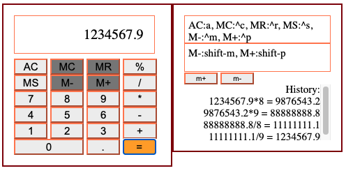

## javaScript
Learning java script

### What I get from [**calculatorV3.html**](calculatorV3.html)
Code done by Ng, date: Sep29,2020.
- Display shown standard keyboard with display, and two memory, and history log.
- **Design aspect**. from addEventListner, **wireframe** ideas of calculator button.
- using **ascii** as reference variable for each button.
- start design in javascript, use **addeventlistener** for input, and **console.log** as display
- use switch case  
- **indexOf** to check double decimal.
- Layout of html use **form**, buttons, and div.
- responsive font size **vw** via viewport.   

### What I get from [**SnakeGameV2.html**](SnakeGameV2.html)
Code done by Ng, date: Oct01,2020.
- Reference from origina SnakeGame.html.   
- Added *change button* which change from START to PAUSE to CONT.. to RELOAD.   
- Using **localStorage.getItem** to contain highScore.
- added GAME ENDED on canvas, via **ctx.fillText**.
- perform refresh of page using **reload()**.
- draw canvas of blackSnake, and animated move
- document.**addEventListener**("keydown", changeDirection);
- orginal **main()** to auto run the game when start. 
- randomTen(min, max)
- let menu = document.getElementById("menuStart"); menu.innerHTML === "START"

